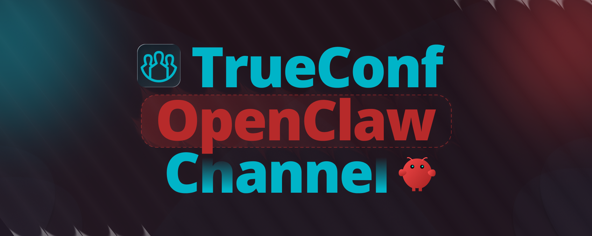

<p align="center">
  
</p>

<h1 align="center">OpenClaw Channel for TrueConf Server</h1>

<p align="center">Connect <a href="https://openclaw.ai/">OpenClaw</a> to the corporate <a href="https://trueconf.com/products/tcsf/trueconf-server-free.html">TrueConf Server</a> messenger. </p>

<p align="center">
    <a href="https://www.npmjs.com/package/@trueconf-community/trueconf-openclaw-channel" target="_blank">
      
    </a>
    
    <a href="https://t.me/trueconf_chat" target="_blank">
        
    </a>
    <a href="https://discord.gg/2gJ4VUqATZ">
        
    </a>
    <a href="#">
        
    </a>
</p>

<p align="center">
  <a href="./README.md">English</a> /
  <a href="./README-ru.md">Русский</a>
</p>

A channel that connects OpenClaw to the TrueConf corporate messenger. After installation, the OpenClaw AI agent communicates with users via TrueConf — messages sent to the bot are forwarded to the AI agent, and responses are delivered back to the chat.

```
[TrueConf client]  ->  [TrueConf Server]  ->  [OpenClaw + plugin]  ->      [LLM]
    you type            Chatbot Connector       receives message        generates
   a message                                     forwards to LLM          response
```

## Agent Capabilities

With this channel, OpenClaw can:

- **Work in group chats** — in a group the bot responds only when mentioned with `@` or when someone replies to its message (see the [Group Chats](#group-chats) section)
- **Work across federation** — a bot on one TrueConf server replies to users on other servers via federation (see the [Cross-Server Federation](#cross-server-federation) section)

## Requirements

- **OpenClaw** >= 2026.3.22
- **TrueConf Server** >= 5.5.3 
- **Bot account** on TrueConf Server 

## Installation

Prerequisites: `node >= 22.14`, `npm`, `openclaw` (`npm install -g openclaw@latest`).

### From npm (recommended)

```bash
openclaw plugins install @trueconf-community/trueconf-openclaw-channel
npx -y -p @trueconf-community/trueconf-openclaw-channel trueconf-setup
openclaw gateway
```

`trueconf-setup` is the channel setup wizard: it prompts for the server URL, bot username and password, verifies TLS and OAuth, and writes the result to `~/.openclaw/openclaw.json`.

### From source 

```bash
git clone https://github.com/TrueConf/trueconf-openclaw-channel.git
cd trueconf-openclaw-channel
npm install
openclaw plugins install -l .
npm run setup      
openclaw gateway
```

### Docker / Ansible / CI

Set environment variables before running `trueconf-setup` — the wizard will detect them and skip all prompts:

```bash
export TRUECONF_SERVER_URL=tc.example.com
export TRUECONF_USERNAME=bot_user              # account login only, without the server address
export TRUECONF_PASSWORD=secret
export TRUECONF_USE_TLS=true                   # optional; default — auto-detect
export TRUECONF_PORT=443                       # optional; any port 1-65535
export TRUECONF_ACCEPT_UNTRUSTED_CA=true       # required if the cert is self-signed and the wizard should download it

openclaw plugins install @trueconf-community/trueconf-openclaw-channel
npx -y -p @trueconf-community/trueconf-openclaw-channel trueconf-setup
openclaw gateway
```

Without `TRUECONF_ACCEPT_UNTRUSTED_CA=true`, on a self-signed certificate the wizard fails with `Self-signed cert detected; set TRUECONF_ACCEPT_UNTRUSTED_CA=true to auto-download chain`.

### Re-running setup

You can run `trueconf-setup` again. You can change and save specific field values as needed.

### Self-signed certificates

If TrueConf Server uses a self-signed certificate, the wizard offers three trust paths in decreasing order of safety:

1. **Point to a CA from your admin** — the recommended path. If the TrueConf Server administrator gave you a root CA in PEM format, set `"caPath": "/path/to/server-ca.pem"` in the config (or pick "Specify path to a root CA certificate" in the interactive wizard).
   - On TrueConf Server the certificate is usually stored as `*.crt`. If the file is in PEM format you can rename it to `*.pem`.
   - If you own the server, find the certificate in the TrueConf Server control panel under HTTPS.
2. **`NODE_EXTRA_CA_CERTS` / system trust** — make the CA root trusted at the OS or Node level (MDM, `update-ca-certificates`, or `export NODE_EXTRA_CA_CERTS=/etc/ssl/certs/corp-ca.pem`). The probe sees the cert as trusted and `caPath` isn't needed at all.
3. **Disable TLS verification** (`tlsVerify: false`) — last resort. Skips certificate verification for **this TrueConf Server only** (other Node HTTPS calls stay verified). Pick "Disable TLS certificate verification for this TrueConf Server" in the wizard, or set `"tlsVerify": false` in the config, or pass `TRUECONF_TLS_VERIFY=false` to the headless setup.

> **Security.** Option #3 makes a MITM attack possible against TrueConf traffic — use it only in a safe or restricted environment (offline lab, trusted internal network). Option #1 is the closest to production-grade.

> **What not to do.** Do **not** set `NODE_TLS_REJECT_UNAUTHORIZED=0`. That env var disables TLS validation for the **entire** Node process — every LLM provider, every webhook, every HTTPS call. The `tlsVerify: false` option above is per-TrueConf only.

### Verifying the channel

The logs should contain:

```
[trueconf] Connected and authenticated
```

Open the TrueConf client, find the bot in your contacts, and send it a message. 

## Configuration

### Single bot account

```json
{
  "channels": {
    "trueconf": {
      "serverUrl": "trueconf.example.com",
      "username": "bot_user",
      "password": "bot_password",
      "useTls": true,
      "port": 443
    }
  }
}
```

`port` is optional — without it the channel uses the default (443 for `useTls:true`, 4309 for `useTls:false`). See the full list of fields in the [reference](#account-field-reference) below.

### Multiple bot accounts

```json
{
  "channels": {
    "trueconf": {
      "accounts": {
        "main-office": {
          "serverUrl": "trueconf.example.com",
          "username": "bot_user",
          "password": "bot_password",
          "useTls": true
        },
        "branch-office": {
          "serverUrl": "branch.example.com",
          "username": "bot_branch",
          "password": "bot_branch_password",
          "useTls": false,
          "port": 5309
        }
      },
      "dmPolicy": "allowlist",
      "allowFrom": ["user1@trueconf.example.com", "user2@trueconf.example.com"],
      "maxFileSize": 10485760
    }
  }
}
```

> **Important:** `dmPolicy`, `allowFrom`, and `maxFileSize` live at the `channels.trueconf` level, **not** inside a specific account. If you put them inside `accounts.*`, the channel ignores them and falls back to defaults.

### Account field reference

| Field | Type | Required | Default | Description |
|-------|------|----------|---------|-------------|
| `serverUrl` | string | Yes | — | TrueConf Server address (e.g., `10.0.0.1` or `trueconf.example.com`) |
| `username` | string | Yes | — | Bot account username on the server (e.g., `bot_user`) |
| `password` | string \| `{ useEnv: string }` | Yes | — | Bot password. Either a string or an env-var reference: `"password": { "useEnv": "TRUECONF_PASSWORD" }` |
| `useTls` | boolean | Yes | — | `true` — connects via wss/https; `false` — via ws/http. |
| `port` | number | No | `443` when `useTls:true`, `4309` when `useTls:false` | TrueConf Server port (1-65535). |
| `clientId` | string | No | `"chat_bot"` | OAuth client_id. Override only if the server is configured with a non-standard chatbot client |
| `clientSecret` | string | No | `""` | OAuth client_secret. Most TrueConf Server installations use a public client (empty secret) |
| `caPath` | string | No | — | Path to a PEM file with the TrueConf Server certificate. Needed if the server uses a self-signed or corporate CA |
| `tlsVerify` | boolean | No | `true` | When `false`, disables TLS certificate verification **for this TrueConf account only** (per-undici/per-ws). Last-resort insecure mode for self-signed servers; do not use in production. Mutually exclusive with `caPath` — the wizard clears the unused field when you switch modes |
| `setupLocale` | `"en"` \| `"ru"` | No | `en` | Wizard interface language. Set automatically by `trueconf-setup` on first run; you can edit it manually or override via `TRUECONF_SETUP_LOCALE=en\|ru`. Runtime logs always stay English |
| `enabled` | boolean | No | `true` | If false, the account won't run in the gateway but remains in the config |

### Channel field reference

| Field | Type | Default | Description |
|-------|------|---------|-------------|
| `dmPolicy` | string | `"open"` | Direct-message access policy: `"open"` (everyone), `"allowlist"` (only users in `allowFrom`), `"closed"` / `"disabled"` (nobody). `"pairing"` is reserved for future functionality and currently behaves like `"open"` |
| `allowFrom` | string[] | — | List of TrueConf IDs (`user@server`) allowed to DM the bot when `dmPolicy: "allowlist"` |
| `maxFileSize` | number (bytes) | `52428800` (50 MB) | Maximum size of a single file. Applies equally to incoming and outgoing files. Range: 1 byte to 2 GB; on out-of-range values the channel logs `[trueconf] Invalid maxFileSize: ...` and falls back to the default |
| `groupAlwaysRespondIn` | string[] | `[]` | List of titles and/or chatIds whose group messages bypass the mention/reply gate. Formats: `<name>`, `title:<name>`, `chatId:<id>`. See ["Always-respond chats"](#always-respond-chats) above |

### TLS mode

`useTls` picks the protocol 

| `useTls` | Protocols | Default port | When to use |
|----------|-----------|--------------|-------------|
| `true` | `wss://` + `https://` | `443` | TrueConf Server with TLS — via Web Manager (443) or a custom TLS port (8443, 9443, ...) |
| `false` | `ws://` + `http://` | `4309` | TrueConf Bridge without TLS — typical for internal networks or behind a reverse proxy |

URLs the plugin builds:
- OAuth token: `{scheme}://{serverUrl}[:{port}]/bridge/api/client/v1/oauth/token`
- WebSocket: `{wsScheme}://{serverUrl}[:{port}]/websocket/chat_bot/`


## Authentication

The plugin uses **OAuth 2.0 Password Grant** to obtain a token and sends the resulting **JWT** in the WebSocket auth packet.

```
1. POST /bridge/api/client/v1/oauth/token
   { "client_id": "chat_bot", "client_secret": "",
     "grant_type": "password", "username": "...", "password": "..." }
   → { "access_token": "<JWT>", "expires_at": 1234567890, ... }

2. WS /websocket/chat_bot/
   → { "type": 1, "method": "auth", "payload": { "token": "<JWT>", "tokenType": "JWT" } }
```

The token is refreshed automatically a minute before `expires_at` — the user does nothing, reconnects are transparent.

## TLS trust for TrueConf Server

TrueConf Server typically runs on-prem with an internal-CA-signed or self-signed TLS certificate. The channel offers three explicit trust paths, listed in decreasing order of safety:

### 1. System trust (default, no action)

Public certificates (Let's Encrypt, etc.) work out-of-the-box. For an internal CA, make the CA root trusted at the OS or Node level:

- **MDM / GPO / Ansible** — push the CA cert to `/usr/local/share/ca-certificates/` (Linux) or the platform equivalent, then run `update-ca-certificates`.
- **`NODE_EXTRA_CA_CERTS`** — set this env var in your systemd unit, Dockerfile `ENV`, or shell profile:
  ```bash
  export NODE_EXTRA_CA_CERTS=/etc/ssl/certs/corp-ca.pem
  ```

The probe detects `authorized: true` and the wizard skips trust prompts.

### 2. `caPath` — admin-provided root CA (recommended)

If the TrueConf Server administrator gave you a root CA in PEM format, point the channel at it:

- **Wizard interactive**: pick "Specify path to a root CA certificate" on the trust prompt, then enter the path.
- **Manual config**: `"caPath": "/path/to/server-ca.pem"` in `~/.openclaw/openclaw.json`.
- **Headless / CI / Docker / systemd**: `export TRUECONF_CA_PATH=/etc/trueconf/ca.pem` before running `trueconf-setup`.

The wizard validates the file (parses as PEM and verifies it validates the live server) before proceeding. If validation fails, setup aborts with a specific reason.

> On TrueConf Server the certificate is usually stored as `*.crt`. If the file is in PEM format you can rename it to `*.pem`. If you own the server, find the certificate in the TrueConf Server control panel under HTTPS.

### 3. `tlsVerify: false` — disable certificate verification (last resort)

For self-signed servers in safe or restricted environments where obtaining the CA isn't practical:

- **Wizard interactive**: pick "Disable TLS certificate verification for this TrueConf Server" on the trust prompt and confirm the MITM warning.
- **Manual config**: `"tlsVerify": false` in `channels.trueconf` (or per account).
- **Headless**: `export TRUECONF_TLS_VERIFY=false` before running `trueconf-setup`.

This is per-TrueConf only — every other Node HTTPS call (LLM provider, webhooks, etc.) keeps verification on. Setting `tlsVerify:false` and `caPath` together is rejected; `TRUECONF_TLS_VERIFY=false` together with `TRUECONF_CA_PATH` is rejected.

> **Security.** Disabling verification opens TrueConf traffic to a MITM. Use this mode only in a safe or restricted environment (offline lab, trusted internal network).

### Re-running the wizard

On every subsequent run of `trueconf-setup`, the stored trust mode is re-checked against the live server. Three outcomes:

- **Silent happy** — stored `caPath` still validates the server, or `tlsVerify:false` is still in effect → no prompts.
- **Trust anchor mismatch** — stored CA no longer validates (cert rotation or MITM). A banner shows both old + new fingerprints and offers: *Abort / Accept new cert / Use admin-provided file*. **Always verify the new fingerprint with the admin out-of-band before accepting.**
- **Missing trust anchor** — the file recorded in config is gone from disk. Banner offers: *Abort / Re-download chain (legacy) / Use admin-provided file*. If the file was removed by an attacker, re-downloading commits you to whatever the server is presenting — verify first.

### Headless-specific notes

`runHeadlessFinalize` (non-interactive setup invoked with `TRUECONF_SERVER_URL`/`_USERNAME`/`_PASSWORD`) mirrors the trust paths above but all failure modes are fatal — no prompts, no recovery:

- `TRUECONF_CA_PATH=/etc/trueconf/ca.pem` — preferred for production CI/Docker.
- `TRUECONF_TLS_VERIFY=false` — last-resort insecure mode. Mutually exclusive with `TRUECONF_CA_PATH`.
- `TRUECONF_ACCEPT_UNTRUSTED_CA=true` — legacy option that auto-downloads the server's chain into `~/.openclaw/trueconf-ca.pem`. **Use only in trusted networks**; anywhere MITM is possible, use `TRUECONF_CA_PATH` or `TRUECONF_TLS_VERIFY=false` instead.

### Wizard language

The setup wizard defaults to **English**. On first run it prompts you to pick `English` or `Russian`; the choice is saved as `channels.trueconf.setupLocale` so re-runs do not re-prompt. Override via `TRUECONF_SETUP_LOCALE=en|ru` (env wins over config; invalid value fails fast). Runtime logs from the gateway stay English regardless.

## Group Chats

The channel works in group chats. Unlike direct messages, where the bot replies to every message, **in a group the bot only responds when explicitly addressed**:

- **`@` mention**
- **reply to the bot's message** — click "Reply" on one of the bot's recent messages. Buffer: last 50 bot messages per chat.

Messages without a reply or mention are visible to the bot but get no response. The log will contain `[trueconf] group <chatId>: no mention/reply, dropping`.

**Technical details:**

- Chat type is determined via `getChatByID` on the first message in a new chat and cached until the gateway restarts. 
- Each group = one shared session. The bot's conversation history is shared across the group, not per participant. Each message's `senderId` is preserved so the LLM knows who is speaking.
- `dmPolicy` applies only to direct messages. In groups, filtering is based solely on mention/reply.
- TrueConf channels (`chatType=6`) are ignored — the bot does not respond in them. Log: `[trueconf] dropping channel message chatId=<id>`.

### Always-respond chats

By default the bot only replies in groups when @-mentioned or replied to. To make the bot respond to every message in a specific group, list it in `groupAlwaysRespondIn`:

```json
{
  "channels": {
    "trueconf": {
      "groupAlwaysRespondIn": [
        "HR-questions",
        "title:#devops",
        "chatId:51ffe1b1-1515-498e-8501-233116adf9da"
      ]
    }
  }
}
```

**Entry formats:**

- `<name>` — the chat title (default). Leading/trailing whitespace and case are normalized; internal whitespace is preserved.
- `title:<name>` — explicitly the title (useful when the title would otherwise look like a chatId).
- `chatId:<id>` — explicitly a chatId. The prefix is required — without it the string is treated as a title.

**Where to find a chatId:** the plugin logs `[trueconf] group <chatId> ...` on the first message from a chat — copy the `<chatId>` value.

**Startup behavior:** the plugin queries the bot's full chat list and matches titles. Titles that don't currently match any group are not an error — the bot may not have been added yet, and the bypass activates automatically when it joins.

**Renames:** if a group's title changes, the plugin re-evaluates. A group whose new title is in `groupAlwaysRespondIn` becomes always-respond; one whose new title isn't is removed. The diff is logged.

**Duplicate titles:** if one configured title matches multiple groups, the bypass applies to all of them and the plugin warns. For pinpoint targeting, use `chatId:`.

**Multi-account:** the list is shared across all accounts in the channel. A title `"HR"` matches the same-named group in every account that has one. `chatId` is globally unique on a TrueConf server — if two accounts are members of the same group, the chatId is identical for both.

**Limitations:**

- Only group chats (`chatType=2`) are activated. Channels (`chatType=6`) are not.
- If `getChats` fails on startup, title-based entries stay inactive until the next successful reconnect — `chatId:` entries always work.
- The list is not hot-reloaded; restart the gateway after changes.

## Cross-Server Federation

If multiple accounts are configured (`accounts.office`, `accounts.support`, ...):

- Each account gets its own WebSocket connection, its own CA trust, its own last-inbound-route buffer, and its own recent-bot-messages cache.
- A single account failing to start doesn't affect the others: the gateway logs `[trueconf] Account <id> startup failed: ...` and continues starting the rest.
- Outgoing-response routing uses `ctx.accountId`. The LLM must know which account to reply from; this is typically derived from the inbound `accountId`.
- `dmPolicy`, `allowFrom`, and `maxFileSize` are shared across all accounts (at the `trueconf.*` level). Per-account versions are not supported.

## Media Files and Limits

The channel sends and receives files via TrueConf: images, audio, video, and documents. Size is limited by `maxFileSize` (see the channel field reference). Default — 50 MB.

## Differences from python-trueconf-bot

This channel is wire-compatible with [python-trueconf-bot](https://github.com/trueconf/python-trueconf-bot) — both speak the TrueConf Chatbot Connector protocol. A handful of user-visible behaviors are deliberately different:

| Behavior | This channel | python-trueconf-bot | Why |
|----------|--------------|---------------------|-----|
| Default text rendering | `parseMode: 'markdown'` | `ParseMode.TEXT` | LLMs emit markdown by default; rendering it in TrueConf gives the user formatted output without extra configuration. |
| Long text (> 4096 chars) | Auto-split into chunks (paragraph → sentence → hard cut), order preserved by a per-chat queue | Truncated server-side | LLM responses regularly exceed the limit; paragraph-first splitting is gentler on markdown. |
| Long captions (> 4096 chars) | Sent as a separate message before the file; file is then sent without caption | Same input is truncated server-side | Best-effort: if `sendFile` fails after the caption was delivered, the channel logs the orphan-text condition explicitly. |
| DNS failures (`ENOTFOUND`, `EAI_AGAIN`, …) | 5 retries (≈ 31 s) then fail-fast | Retried indefinitely | Inside an OpenClaw runtime, an unresolvable hostname is almost always a typo in `serverUrl`; surfacing it loudly is more useful than retrying forever. |
| Token expiry (`errorCode: 203`) on any RPC | Transport-level reconnect with fresh OAuth + transparent retry of the original request | User-level pattern via `examples/update_token.py` | Plugins should not require example boilerplate to stay connected. |

The `setChatMutationHandler` callback (edit / remove / clearHistory events) is intentionally not exposed in v1.2.0; it is planned for a follow-up release.

## Troubleshooting

### `fetch failed` on startup

- **Cause:** The TrueConf Server certificate is not from a public CA (self-signed or from a corporate CA), and Node.js doesn't trust it.
- **Solution:** Re-run `trueconf-setup`. Pick "Specify path to a root CA certificate" and provide a `.pem` from the server admin (preferred), or "Disable TLS certificate verification for this TrueConf Server" if you accept the MITM risk for this transport (last resort). You can also set `"caPath": "/path/to/ca.pem"` or `"tlsVerify": false` in the config manually, or export `NODE_EXTRA_CA_CERTS=/path/to/ca.pem` for system-wide trust. See [TLS trust for TrueConf Server](#tls-trust-for-trueconf-server).
- **What not to do:** `NODE_TLS_REJECT_UNAUTHORIZED=0` disables TLS validation for the **entire** Node process, including calls to the LLM provider and any other endpoints. Use the per-account `tlsVerify: false` option above if you need an insecure mode — it scopes the bypass to TrueConf only.

### `blocked URL fetch ... resolves to private/internal/special-use IP address`

- **Cause:** A corporate proxy or VPN redirects LLM-provider requests (e.g., api.openai.com) to an internal address.
- **Solution:** Configure a proxy (`HTTPS_PROXY`) or use a local model via Ollama.

### `Missing API key for provider "openai"`

- **Cause:** LLM provider is not configured.
- **Solution:** Run `openclaw configure` and pick a provider (OpenAI, Ollama, etc.).

### Invalid credentials

- **Symptom:** `OAuth token acquisition failed (401): invalid_grant` in the logs.
- **Cause:** Wrong `username` or `password` in the config.
- **Solution:** Make sure `username` is just the account name (`bot_user`), without `@server.trueconf.name`; the server address goes separately in `serverUrl`. Verify the account is active in the TrueConf Server admin panel. If the server is configured with a non-standard OAuth client, set `clientId` and `clientSecret` in the config.

### TLS mismatch

- **Symptom:** `WebSocket error: connect ECONNREFUSED` right after start.
- **Cause:** `useTls` doesn't match the server's configuration, or the `port` is wrong.
- **Solution:** Make sure `useTls` matches the server's protocol (TLS ↔ true). If the port is non-default, set `port` explicitly. See [TLS mode](#tls-mode).

### Port blocked by firewall

- **Symptom:** `WebSocket error: connect ECONNREFUSED` or `ETIMEDOUT` with otherwise-valid `serverUrl`/`useTls`.
- **Cause:** The firewall blocks the chosen port (4309, 443, or a custom one).
- **Solution:** Open the port on the firewall, or switch to a different port/mode (Web Manager on 443 with `useTls:true`, Bridge on 4309 with `useTls:false`, a custom port via the `port` field).

### Bot connects but doesn't respond

- **Symptom:** The log shows `Connected and authenticated`, but there are no replies.
- **Possible causes:**
  1. You're messaging the bot from the same account — you need to write from a **different** user.
  2. Group-chat message without an @-mention and without a reply to the bot — in a group you have to address the bot explicitly (see the [Group Chats](#group-chats) section). The log will contain `group <chatId>: no mention/reply, dropping`.
  3. Message in a TrueConf channel (`chatType=6`) — the bot ignores them. Log: `dropping channel message chatId=<id>`.
  4. `dmPolicy: "allowlist"` and the sender isn't in `allowFrom`. Log: `DM blocked for <id> by policy`.
  5. LLM provider is not configured — run `openclaw configure`.
  6. LLM provider is unreachable from the network — check access or use Ollama.

### Bot sends a photo without the caption

- **Symptom:** The agent replies "Here's a cat 🐱" with an attached picture; the TrueConf chat only shows the photo, the text is gone.
- **Cause:** In openclaw `2026.4.22`, when `agents.defaults.blockStreamingDefault` is `"off"` (also the default when the field is unset), the caption and the media are split into separate blocks and the text part is dropped by the final filter before reaching the plugin's deliver.
- **Fix:**
  ```bash
  openclaw config set agents.defaults.blockStreamingDefault on
  openclaw config set agents.defaults.blockStreamingBreak message_end
  ```
  Then restart the gateway. The agent will hand text and media to the plugin as a single block, and the plugin will send the photo with the caption.

### Frequent reconnects

- **Symptom:** `[trueconf] Connection closed, scheduling reconnect` repeats in the logs.
- **Cause:** WebSocket connection drop at the network layer. Heartbeat runs as ping/pong on a 20-second interval — if two pongs in a row don't arrive within 20 seconds, the connection is considered dead and the plugin reconnects. 
- **Solution:** Check network stability to TrueConf Server, traceroute, MTU, corporate proxy/VPN between the client and the server. If there's a reverse proxy (nginx, haproxy) between the plugin and the server, make sure the WebSocket idle-connection timeouts there are large enough.


### Finding the logs

All plugin messages are prefixed with `[trueconf]`. To filter:

**Linux/macOS:**

```bash
openclaw gateway 2>&1 | grep '\[trueconf\]'
```

**Windows (PowerShell):**

```powershell
openclaw gateway | Select-String '\[trueconf\]'
```

Log file: the path is shown in the gateway output (`[gateway] log file: ...`).

## Testing

```bash
npm test
```

## License

MIT
